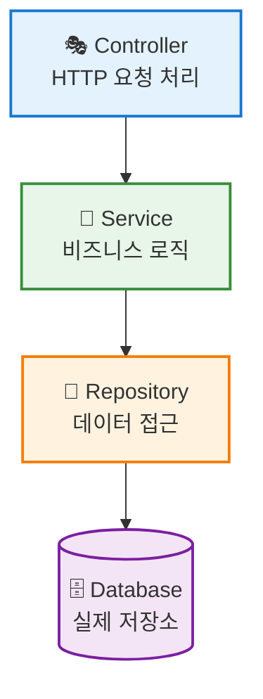
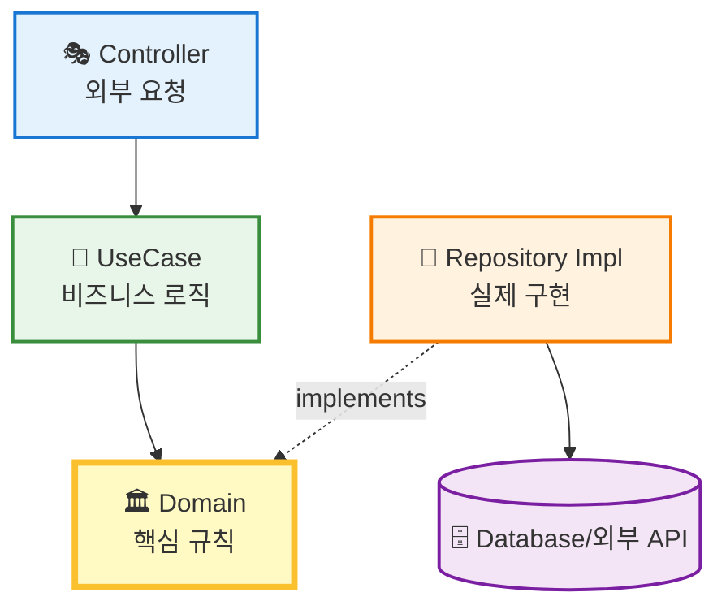

# ⚖️ Layered vs Clean Architecture 비교 분석

## 🎯 목표
Blog API 리팩토링을 위해 두 아키텍처의 장단점을 비교하고, 현재 프로젝트 상황에 최적화된 선택을 돕습니다.

## 🏗️ 1. 한눈에 보는 구조 차이

### 🌊 A. Layered Architecture (계층형)
**"위에서 아래로 흐르는 직관적인 구조"**



#### 🔍 특징
- **직접 의존**: 상위 계층이 하위 계층을 **직접 import**하여 사용
- **장점**: 구조가 직관적이고, 파일 개수가 적으며 개발 속도가 빠름
- **단점**: 비즈니스 로직이 DB 구현체에 강하게 결합되어 유연성이 떨어짐

---

### 🧅 B. Clean Architecture (클린)
**"중심(도메인)을 철저히 보호하는 구조"**



#### 🔍 특징
- **의존성 역전**: 모든 화살표가 **도메인(중심)**을 향함
- **장점**: 외부(DB/API) 변경 시 비즈니스 로직은 절대 수정할 필요 없음
- **단점**: 파일이 많아지고 인터페이스 관리가 필요함

## 💻 2. 코드 레벨 비교 (Post 목록 조회)

### 🌊 Layered Architecture 코드

**`src/services/post.service.ts`**
```typescript
// ❌ 문제점: 서비스가 구체적인 구현체를 직접 import (결합도 높음)
import { PostRepository } from '../repositories/post.repository';

export class PostService {
  constructor(private repo: PostRepository) {}

  async getPosts(userId: string) {
    // 권한 체크, 데이터 변환 등의 비즈니스 로직...
    return this.repo.findAll();
  }
}
```

### 🧅 Clean Architecture 코드

**`src/application/usecases/get_posts.usecase.ts`**
```typescript
// ✅ 장점: UseCase는 인터페이스만 의존, 실제 구현체는 모름
import { IPostRepository } from '../../domain/repositories/post.repository';

export class GetPostsUseCase {
  // 생성자 주입 (Dependency Injection)
  constructor(private repo: IPostRepository) {}

  async execute(userId: string) {
    // 권한 체크, 데이터 변환 등의 비즈니스 로직...
    return this.repo.findAll();
  }
}
```

## 📊 3. 항목별 상세 비교

| 🔍 비교 항목 | 🌊 Layered (실용주의) | 🧅 Clean (완벽주의) |
|-------------|----------------------|---------------------|
| **📁 파일 개수** | 적음 (기능당 3개: Controller, Service, Repository) | 많음 (기능당 5개+: Controller, UseCase, DTO, Entity, Interface) |
| **⚡ 구현 난이도** | 쉬움 (직관적 흐름) | 중간 (DI, 의존성 역전 개념 필요) |
| **🔄 유연성** | 보통 (DB 변경 시 Service 수정 가능성 있음) | **최상** (DB 변경 시 로직 수정 **0**) |
| **🧪 테스트 용이성** | DB 연결 필요 또는 Mocking 복잡 | **매우 쉬움** (DB 없이 단위 테스트 가능) |
| **🤖 AI(Cursor) 활용** | AI가 코드를 빨리 생성할 수 있음 | AI가 구조를 잘 지켜주면 **가장 강력함** |
| **📚 학습 곡선** | 낮음 (기존 MVC 패턴과 유사) | 높음 (새로운 개념 다수) |
| **🛠️ 유지보수성** | 중간 (결합도가 높아 변경 영향 범위 큼) | 높음 (인터페이스로 결합도가 낮음) |

## 🎯 4. 결정 가이드: 어떤 걸 선택해야 할까?

### ✅ Layered를 선택하세요 만약...
1. **⚡ "빨리 기능을 완성하고 싶어."** (MVP 개발, 빠른 프로토타이핑)
2. **🔒 "DB를 Supabase에서 다른 걸로 바꿀 일이 당분간 절대 없어."**
3. **📂 "파일이 너무 잘게 쪼개져 있으면 오히려 읽기 힘들어."**
4. **💻 "나는 프론트엔드 개발자라 백엔드는 심플한 게 좋아."**
5. **🚀 "프로젝트 규모가 작고 복잡한 구조가 필요하지 않아."**

### ✅ Clean을 선택하세요 만약...
1. **🏛️ "나는 코드의 '깔끔함'과 '구조적 아름다움'을 중요하게 생각해."**
2. **🔄 "나중에 블로그 데이터를 GitHub 말고 Notion이나 다른 CMS로 바꿀 수도 있어."**
3. **🤖 "AI(Cursor)에게 맡길 거니까 파일이 많아지는 건 상관없어."**
4. **📚 "이참에 '의존성 역전' 같은 백엔드 핵심 패턴을 제대로 공부해보고 싶어."**
5. **🏢 "프로젝트가 성장할 가능성이 높아 확장성을 고려해야 해."**

## 🤝 5. 파트너의 추천 (Coding Partner)

현재 프로젝트는 **개인 블로그**이며, **Cursor AI**를 적극 활용하고 계십니다.

### 📈 실용성 관점
`Layered`가 적합합니다. 블로그 기능에 Clean Architecture는 다소 과한 엔지니어링일 수 있습니다.

### 🎓 학습/확장성 관점
`Clean`이 적합합니다. AI가 보일러플레이트 코드를 생성해주기 때문에 복잡함이라는 단점이 상쇄되고, 구조적으로 매우 견고해집니다.

## 💡 결론

마음이 **Clean Architecture** 쪽으로 기우신다면, **Clean Architecture로 진행하는 것을 추천합니다.**

**이유**: AI가 코딩을 도와주기 때문에 "복잡함"이라는 단점이 사라지고 "유지보수성"과 "확장성"이라는 장점만 남기 때문입니다. 개인 프로젝트라도 좋은 아키텍처 패턴을 익히는 좋은 기회가 될 것입니다! 🚀