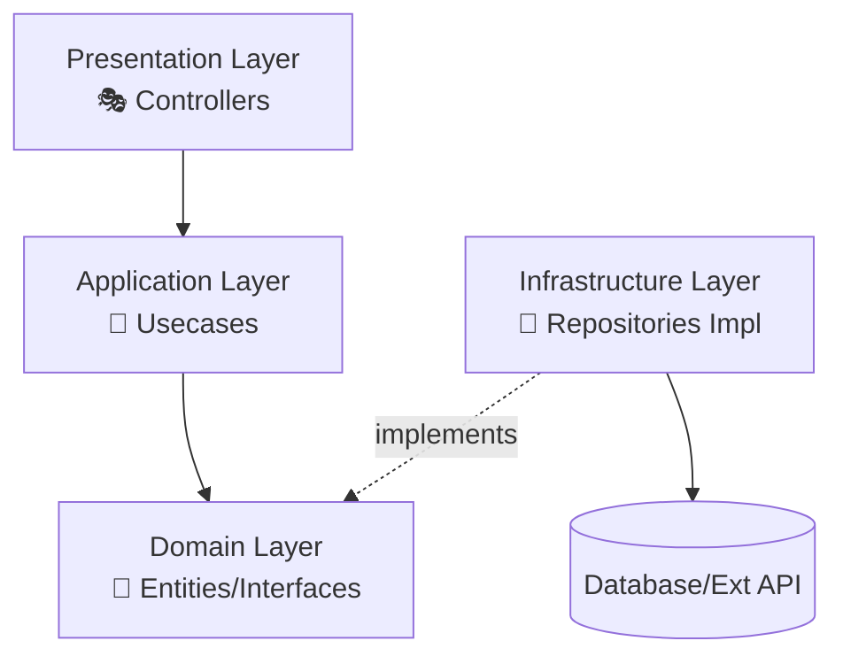

# 🏛️ Blog API 리팩토링 계획 (Clean Architecture)

## 🎯 목표
의존성 역전 원칙(DIP)을 적용한 **Clean Architecture**로 전환하여, 비즈니스 로직과 외부 인프라(DB, API)를 완벽히 분리합니다.

**네이밍 규칙**: [NAMING_CONVENTIONS.md](./NAMING_CONVENTIONS.md)를 따릅니다.

## 🏛️ 1. 아키텍처 개요

데이터의 흐름은 **단방향**이 아니며, 의존성의 방향은 항상 **내부(Domain/Application)**를 향해야 합니다.



### 🔑 핵심 원칙
- **의존성 역전**: 외부 레이어는 내부 레이어를 참조하지만, 내부는 외부를 참조하지 않음
- **단일 책임**: 각 레이어는 하나의 책임만 가짐
- **테스트 용이성**: 외부 의존성이 인터페이스로 추상화되어 테스트가 쉬움

## 📁 2. 폴더 구조 (TO-BE)

```
api/src/
├── domain/                 # [🏛️ 가장 안쪽] 비즈니스 핵심 개념 및 인터페이스
│   ├── entities/           # 📝 순수 데이터 모델 (DB 테이블과 무관한 도메인 객체)
│   └── repositories/       # 🔌 Repository 인터페이스 정의 (구현 없음)
├── application/            # [🧠 중간] 비즈니스 로직 (Usecases)
│   ├── usecases/           # ⚡ 실제 기능 구현 (Service)
│   └── dtos/               # 📦 계층 간 데이터 전송 객체 (Input/Output)
├── infrastructure/         # [💾 바깥쪽 1] 외부 시스템 구현체
│   ├── repositories/       # 🔧 domain/repositories의 실제 구현 (Supabase, GitHub 등)
│   ├── external/           # 🌐 외부 API 클라이언트 설정
│   └── config/             # ⚙️ 환경 변수 등 설정
└── presentation/           # [🎭 바깥쪽 2] 외부 요청 처리
    ├── controllers/        # 🌐 HTTP 요청 핸들링
    └── middlewares/        # 🛡️ 공통 미들웨어
```

## 📋 3. 계층별 역할 및 규칙

### 🏛️ A. Domain Layer (`domain/`)
**역할**: 비즈니스 핵심 로직과 규칙을 정의하는 가장 안쪽 레이어

- **특징**: 외부 세계(DB, 프레임워크)에 대해 아무것도 모름. 외부 라이브러리 import 최소화
- **entities/**: 비즈니스 핵심 객체 타입 정의
  - 예시: `User`, `Post`, `BlogPermissions`
- **repositories/**: 저장소 **인터페이스(Interface)** 정의
  - 예시: `IPostRepository` (save, findById 등의 메서드 시그니처만 존재)

### 🧠 B. Application Layer (`application/`)
**역할**: 비즈니스 유스케이스를 조율하고, 도메인 엔티티를 활용하여 실제 기능을 구현

- **특징**: 도메인 엔티티와 리포지토리 인터페이스를 사용하여 애플리케이션 기능 구현
- **usecases/**: 사용자 시나리오 단위의 로직
  - 예시: `CreatePostUseCase`, `GetPostListUseCase`, `AuthenticateUserUseCase`
  - **규칙**: 구현체(`infrastructure`)를 직접 import하지 않고, `domain`의 인터페이스에 의존 (DI)
- **dtos/**: 컨트롤러 ↔ 유스케이스 간 데이터 포맷
  - 예시: `CreatePostInputDto`, `PostOutputDto`, `AuthRequestDto`

### 💾 C. Infrastructure Layer (`infrastructure/`)
**역할**: 외부 시스템과의 실제 통신을 담당하는 기술적 구현 레이어

- **특징**: 실제 기술적인 구현을 담당하며, domain의 인터페이스를 구현
- **repositories/**: `domain`에 정의된 인터페이스를 실제로 구현(implements)
  - 예시: `SbPostRepository` (Supabase 사용), `GhPostRepository` (GitHub API 사용)
  - 실제 DB 쿼리나 API 호출이 여기서 발생
- **external/**: 외부 서비스 클라이언트 (Google OAuth, GitHub API 등)
- **config/**: 환경 변수, 데이터베이스 연결 설정 등

### 🎭 D. Presentation Layer (`presentation/`)
**역할**: 외부 요청을 받아 내부 유스케이스를 실행하고 응답을 반환

- **특징**: HTTP 요청을 받아 적절한 Usecase를 실행하고 응답을 보냄
- **controllers/**: `req` 파싱 → `DTO` 변환 → `UseCase` 실행 → `res` 응답
- **middlewares/**: 인증, 로깅, 에러 핸들링 등 공통 처리

## 🔄 4. 리팩토링 상세 매핑 가이드

### 📄 1. Post 관련 (`api/posts.ts` 등)

**Domain Layer:**
- `domain/entities/post.entity.ts`: Post 타입 정의
- `domain/repositories/post.repository.ts`: `interface IPostRepository { findAll(): Promise<Post[]>; save(post: Post): Promise<void>; ... }`

**Infrastructure Layer:**
- `infrastructure/repositories/sb_post.repository.ts`: Supabase를 이용해 위 인터페이스 구현
- `infrastructure/repositories/gh_post.repository.ts`: GitHub API를 이용해 구현 (필요 시)

**Application Layer:**
- `application/usecases/post/get_posts.usecase.ts`: 게시물 목록 조회 비즈니스 로직
- `application/usecases/post/create_post.usecase.ts`: 게시물 생성 로직
- `application/dtos/post/post.dto.ts`: 입력/출력 데이터 구조

**Presentation Layer:**
- `presentation/controllers/post.controller.ts`: HTTP 요청 처리

### 🔐 2. Auth 관련 (`api/auth/google.ts`)

**Domain Layer:**
- `domain/entities/user.entity.ts`: User 엔티티 정의
- `domain/repositories/auth.repository.ts`: 인증 관련 인터페이스

**Infrastructure Layer:**
- `infrastructure/external/google_auth.provider.ts`: Google OAuth API 호출 구현
- `infrastructure/repositories/user.repository.ts`: 사용자 데이터 저장소 구현

**Application Layer:**
- `application/usecases/auth/login_google.usecase.ts`: Google 로그인 유스케이스
- `application/dtos/auth/auth.dto.ts`: 인증 관련 DTO

**Presentation Layer:**
- `presentation/controllers/auth.controller.ts`: 인증 요청 처리

## 📝 5. 작업 순서 (AI 지시용)

1. **🏛️ Domain 정의**: `domain/` 폴더를 만들고 Entity와 Repository Interface를 먼저 정의 (가장 중요)
2. **🧠 Application 구현**: `application/` 폴더에서 Usecase를 작성. Repository는 인터페이스로만 사용
3. **💾 Infrastructure 구현**: `infrastructure/` 폴더에서 실제 DB/외부 API와 통신하는 코드를 작성하여 인터페이스 구현
4. **🎭 Presentation 연결**: 마지막으로 HTTP 요청을 받는 Controller를 작성하여 Usecase와 연결

## ⚠️ 6. 주의사항

- **의존성 방향**: 항상 외부 → 내부 방향으로 의존성 흐름 유지
- **인터페이스 분리**: 각 Repository 인터페이스는 단일 책임을 가지도록 설계
- **테스트 전략**: 각 레이어를 독립적으로 테스트할 수 있도록 인터페이스 기반 설계
- **마이그레이션**: 기존 코드를 점진적으로 Clean Architecture로 이전